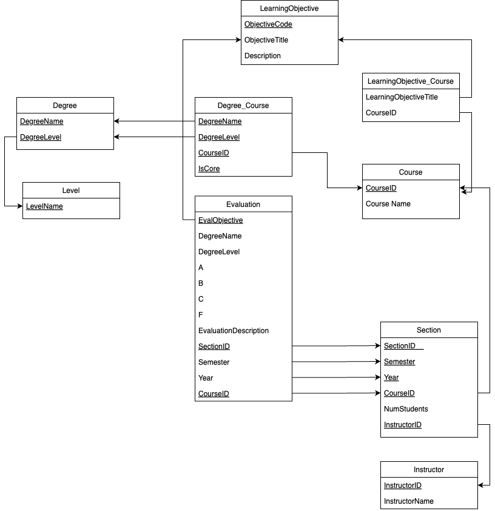

# Database-Final-Proj

## Description
This project aims to implement a database solution, using mySQL as the backend, to store and evaluate university degree programs.

## Database Schema


## Installation

### Python
1. If you haven't already, download and install Python from [Python's official website](https://www.python.org).
2. Make sure to check the box that says "Add Python to PATH" during installation.
3. Verify the installation by opening a command prompt or terminal and typing '**python --version**'. You should see the installed Python version.

### MySQL
1. Download and install MySQL from [MySQL's official website](https://www.mysql.com).
2. During installation, note down the password you set for the root user.
3. After installation, open MySQL Command Line Client and enter the root password when prompted:

#### Windows:
- Click on the Start menu.
- Type "MySQL Command Line Client" and press Enter.
- Enter the root password when prompted.

#### macOS:
- Open Terminal.
- Type the following command and press Enter:
```
mysql -u root -p
```
- You'll be prompted to enter the root password. Type the password and press Enter.

#### Linux:
- Open Terminal.
- Type the following command and press Enter:
```
sudo mysql -u root -p
```
- You'll be prompted to enter the root password. Type the password and press Enter.

4. Execute the following SQL commands to create a database and a user based on the configuration provided in '**config.json**':
```
CREATE DATABASE db_final_project;
CREATE USER 'root'@'localhost' IDENTIFIED BY 'psw';
GRANT ALL PRIVILEGES ON db_final_project.* TO 'root'@'localhost';
FLUSH PRIVILEGES;
```

### MySQL Connector
1. Install MySQL Connector for Python using pip, Python's package manager, by running the following command:
```
pip install mysql-connector-python
```

### Flask
1. Install Flask using pip by running the following command:
```
pip install Flask
```

### Configuration
Before running the application, make sure the '**config.json**' file contains the appropriate database connection details:
```
{
    "host": "localhost",
    "user": "root",
    "password": "psw",
    "database": "db_final_project"
}
```

## Usage
To run the application, navigate to the project directory in the command prompt or terminal and execute the following commands:
```
python DB_Setup.py
python GUI.py
```
This will create the appropriate tables in the '**db_final_project**' database and then start the Flask application. You should be able to access it through a web browser at '**http://127.0.0.1:5000**'.

### Data Entry
The following section will teach you the order in which you are allowed to add entries to the database. Certain entities are dependent on the existence of other entities, such as Section and Course, so those other entities have to be created first. Feel free to open MySQL Command Line Client to verify that the various information have been correctly entered and stored into the database.

#### Add a Level:
- For a Degree to exist, you must first define a Level (BA, BS, MS, Ph.D., Cert, etc.):


#### Add a Degree:
- Now that a Level exists, you can define a Degree with that Level:


#### Add an Instructor:
- Before you can start creating Courses, you must first define some Instructors to teach those Courses:


#### Add a Course:
- Let's assign that Instructor you just created to a new Course:
    - Fill out the necessary Course details (ensure the Degree Name and Level matches an existing Degree and Level) and note whether the Course is a Core Course or not. 
    - A Course requires a Section to exist so when you create a new Course, you must also create a new Section for it (ensure the Instructor ID matches an existing Instructor ID).


#### Add a Section:
- A Course may have more than one Section, so let's add another Section to the Course we just created:


#### Add a Learning Objective:
- To evaluate a Degree program, we must define Learning Objectives that their Courses will be evaluated on:


#### Add an Evaluation:
- With all the necessary components for an Evaluation created, let's now submit an Evaluation. First, enter the Degree Name, Degree Level, Semester, Year, and Instructor ID for the Course under evaluation:


- Next, select the Section for which this Evaluation is associated with. We will choose '**Section 001**' for this example run:


- Then, choose the Learning Objective that this Evaluation is assesing (we have only created one Learning Objective thus far):


- Lastly, enter the grade distribution among the students for that specific Section. Note that entries can be left blank for now and updated later by going through this same process and entering the exact same information:


#### Associate an Existing Learning Objective to a Course:
- A Course may want to associate an existing Learning Objective with it. To show this, let's first create another Course:


- Now we can associate our existing Learning Objective '**Querying**' to this new Course:


#### Assign Existing Course to a Degree:
- A Course may be part of the curriculum of multiple Degrees. We can establish these associations by entering the Course ID (department code + course number) and the Degree Name and Level. First, let's create a new Degree:


- Associate our '**CS5330**' Course with this new Degree:


### Query
We have gone over all the functionalities of the Data-Entry portion. Now let's explore how we can retrieve all the information we have stored.

#### List Courses Given Degree:
- Provide Degree Name and Level to retrieve all Courses associated with the Degree, as well as whether the Course is a Core Course or not:


#### List Sections Given Degree:
- Provide Degree Name, Level, and a time range to retrieve all Sections offered in chronological order:


#### List Learning Objectives Given Degree:
- Provide Degree Name and Level to retrieve all Learning Objectives associated with the Degree:


#### List Courses Per Objective Given Degree:
- Provide Degree Name and Level to retrive all Learning Objectives and for each Objective, list the Courses associated with it (can toggle which Objective's Courses to be shown):


#### List Sections Given Course:
- Provide Course ID (department code + course number) and time range to retrieve all Sections under the Course:


#### List Sections Given Instructor:
- Provide Instructor ID and time range to retrieve all Sections that he/she has taught:


#### List Sections Given Semester/Percentage:
- Provide semester, year, and a percentage value to retrieve all Sections where the number of students that did not get the ‘**F**’ grade reached that percentage. In '**Section 001**' of Course '**CS5330**', **28** out of the **30** students did not get the '**F**' grade (~**93.33%**). Let's choose a value above and below this percentage to see how this query will return.

- Choosing a percentage value of '**95**':


- Choosing a percentage value of '**90**':


#### List Sections & Evaluation Status Given Semester:
- Provide semester and year to retrieve all Sections and for each section, state whether the Evaluation objectives have been entered, partially entered, or not entered at all (in regards to A, B, C, F and not the optional Improvement paragraph).


## That is all! :D
